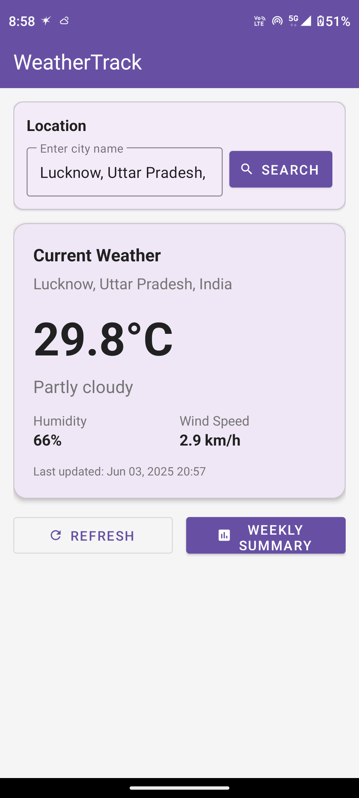
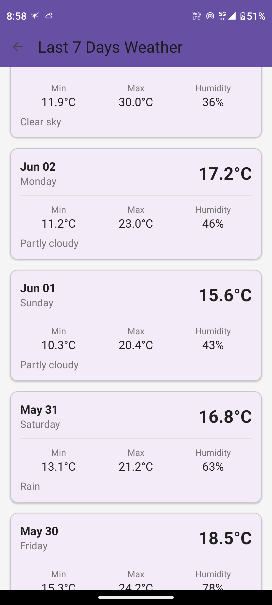
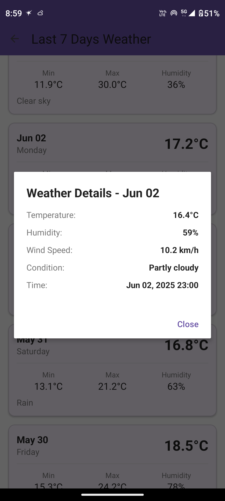
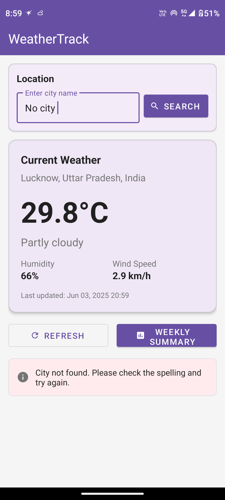

# WeatherTrack

A modern Android weather tracking application that provides real-time weather updates and historical weather data analysis for any location worldwide.


##  Features

### Core Features
- **Real-time Weather Data**: Get current weather conditions including temperature, humidity, wind speed, and weather conditions
- **Location Search**: Search and save weather data for any city worldwide
- **Historical Data**: Automatically fetches and stores the last 7 days of weather history
- **Weekly Summary**: View temperature trends and weather patterns over the past week
- **Background Sync**: Automatic weather updates every 6 hours using WorkManager
- **Offline Support**: View previously fetched data even without internet connection

### Technical Features
- **MVVM Architecture**: Clean separation of concerns with ViewModel and LiveData
- **Room Database**: Local data persistence for offline access
- **Retrofit**: Type-safe HTTP client for API calls
- **WorkManager**: Reliable background task scheduling
- **Material Design**: Modern UI following Material Design guidelines

##  Screenshots

| Main Screen | Weekly Summary | Day wise Summary | Error Handling |
|------------|----------------|-----------------|-----------------|
|  |  |  |  |

##  Tech Stack

- **Language**: Java
- **Architecture**: MVVM (Model-View-ViewModel)
- **Database**: Room Persistence Library
- **Networking**: Retrofit 2.9.0
- **Background Tasks**: WorkManager 2.9.0
- **UI Components**: Material Design Components
- **Weather API**: [Open-Meteo API](https://open-meteo.com/)
- **Geocoding API**: [Open-Meteo Geocoding](https://open-meteo.com/en/docs/geocoding-api)

##  Project Structure

```
WeatherTrack/
├── app/
│   ├── src/main/java/com/example/weathertrack/
│   │   ├── data/
│   │   │   ├── local/          # Room database
│   │   │   │   ├── WeatherDao.java
│   │   │   │   └── WeatherDatabase.java
│   │   │   ├── model/          # Data models
│   │   │   │   ├── Weather.java
│   │   │   │   ├── OpenMeteoResponse.java
│   │   │   │   └── GeocodingResponse.java
│   │   │   ├── remote/         # API services
│   │   │   │   ├── WeatherApiService.java
│   │   │   │   └── RetrofitClient.java
│   │   │   └── repository/     # Repository pattern
│   │   │       └── WeatherRepository.java
│   │   ├── ui/
│   │   │   ├── main/           # Main activity
│   │   │   └── summary/        # Summary activity
│   │   │       ├── SummaryActivity.java
│   │   │       └── WeatherDayAdapter.java
│   │   ├── utils/              # Utility classes
│   │   │   ├── Constants.java
│   │   │   ├── DateConverter.java
│   │   │   └── WeatherCodeMapper.java
│   │   ├── viewmodel/          # ViewModels
│   │   │   └── WeatherViewModel.java
│   │   └── worker/             # Background workers
│   │       └── WeatherSyncWorker.java
│   └── res/
│       ├── layout/             # XML layouts
│       ├── values/             # Resources
│       └── drawable/           # Icons and drawables
```

##  Configuration


##  Key Components


### Repository Pattern
The app uses the Repository pattern to abstract data sources:
- Fetches data from Open-Meteo API
- Caches data in Room database
- Provides a single source of truth

### Background Sync
WorkManager ensures weather data is updated every 6 hours:
- Respects device battery optimization
- Works even if the app is closed
- Requires network connectivity

##  API Endpoints Used

### Weather API
- **Current Weather**: `https://api.open-meteo.com/v1/forecast`
- **Historical Weather**: `https://historical-forecast-api.open-meteo.com/v1/forecast`

### Geocoding API
- **City Search**: `https://geocoding-api.open-meteo.com/v1/search`


## Acknowledgments

- [Open-Meteo](https://open-meteo.com/) for providing free weather API
- [Material Design](https://material.io/) for design guidelines
- [Android Developers](https://developer.android.com/) for excellent documentation

---

<p align="center">Made with ❤️ by [Shiv Prakash Verma]</p>

